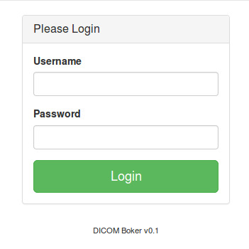
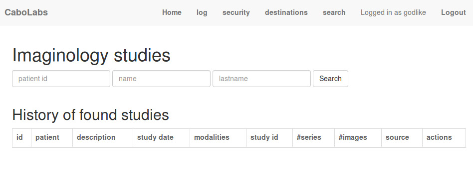
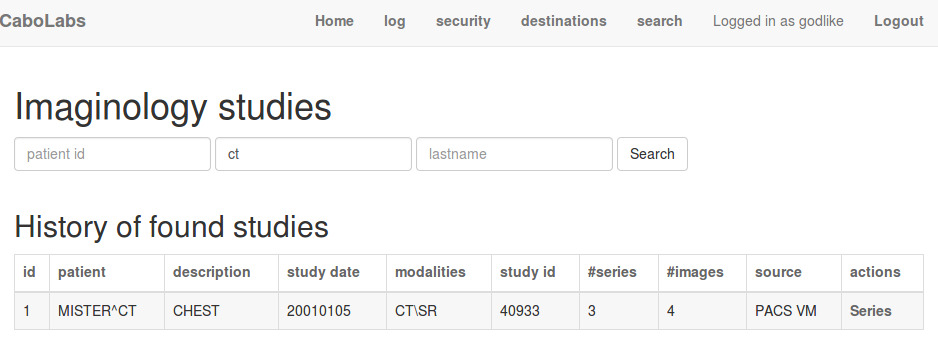
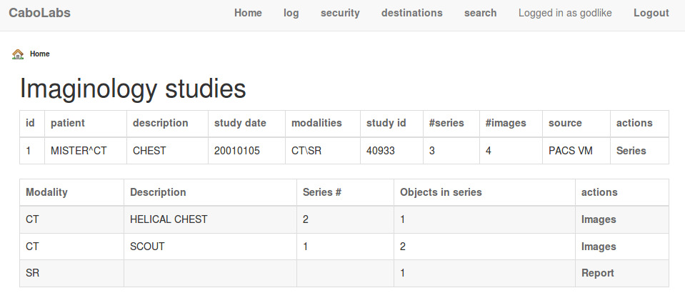
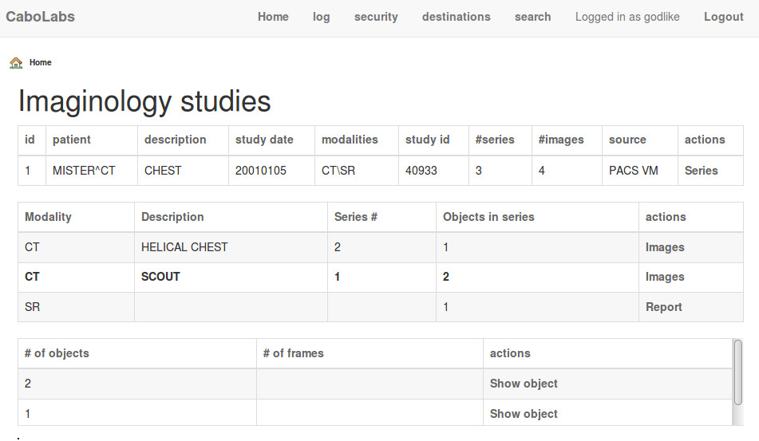
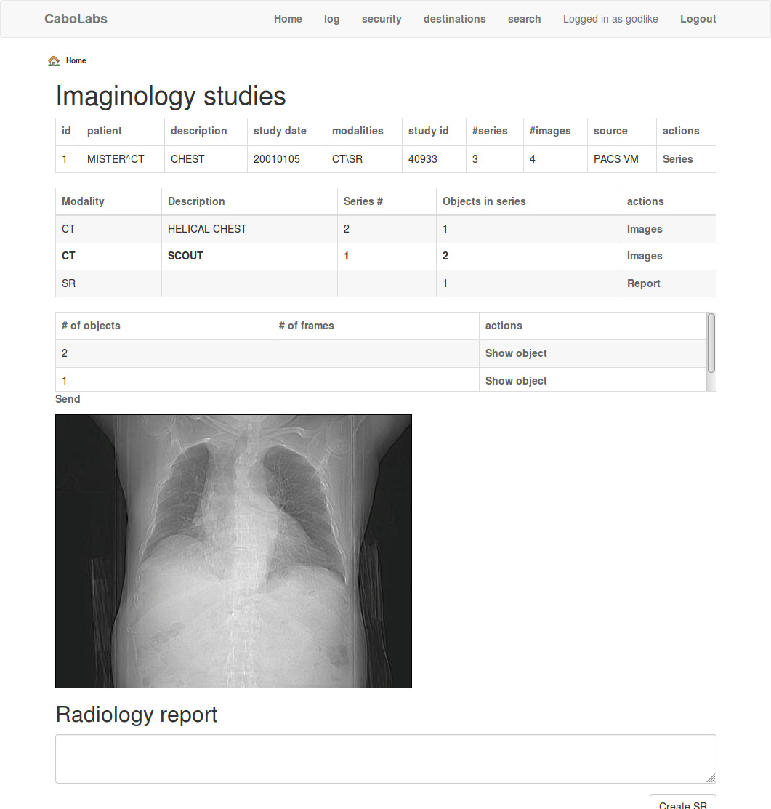
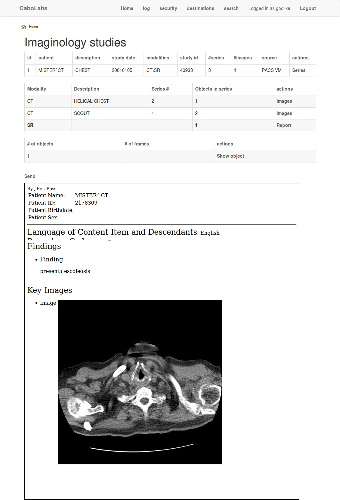

CaboLabs DICOM Broker!
======================

Grails application to query, retrieve, visualize DICOM Imaginology Studies and Structured Reports from a set of remote PACS.

## Basic flow

1\. Login using sample users (check Bootstrap.groovy)

2\. Search for studies, by ID or patient name

This search will be executed on all the PACS you have connected to the DICOM Broker! A common use case is when trying to access studies from a network of clinics or hospitals.

3\. Get studies back

4\. Navigate inside the studies to display series

5\. Check the objects on a series

6\. Display an image object from the PACS

7\. Display a report object from the PACS

Contact me if you want to use it, extend it or adapt it. pablo.pazos@cabolabs.com
